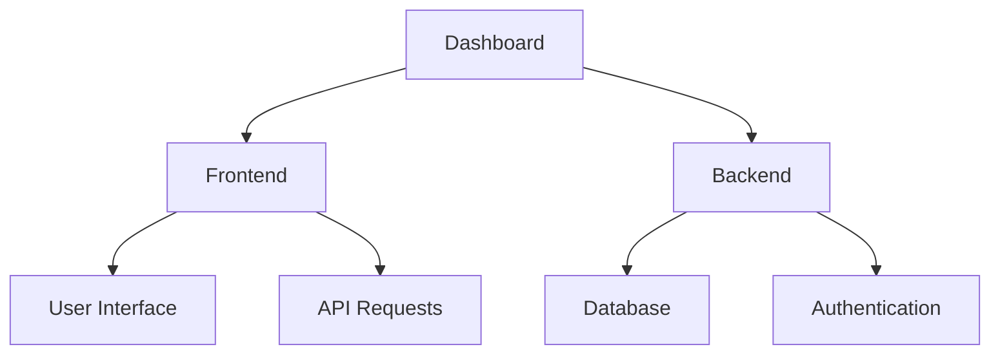

```mermaid
  graph TD;
      A[Dashboard] --> B[Frontend];
      A --> C[Backend];
      B --> D[User Interface];
      B --> E[API Requests];
      C --> F[Database];
      C --> G[Authentication];
```